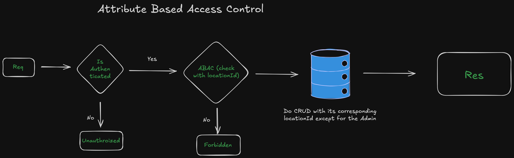

# Attribute-Based Access Control (ABAC)

This system implements ABAC using CASL (CASLjs) for fine-grained authorization with location-based multi-tenancy.

## Overview

ABAC Flow: `JWT Token → User + Role + Permissions → Define Abilities → Authorize Request`



## Database Schema

```prisma
model User {
  id          String
  locationId  Int      // Key attribute for multi-tenancy
  roleId      Int
  role        Role
}

model Role {
  name        String
  permissions Permission[]  // Many-to-many
}

model Permission {
  action   String  // manage, read, create, update, delete
  subject  String  // all, Patient, Doctor, Item, etc.
  roles    Role[]  // Many-to-many
}
```

## Authentication Flow

### 1. Verify Auth Middleware

Extracts JWT and loads user with abilities.

```typescript
// src/middlewares/verifyAuth.ts
const verifyAuth = async (req: Request, res: Response, next: NextFunction) => {
  const token = req.signedCookies.posToken;
  const { id } = verfiyToken(token);

  // Load user with role & permissions
  const user = await authService.findInfo(id);

  // Resolve permission dependencies
  const depMap = resolvePermissionDependencies(user);

  // Define abilities with location conditions
  req.ability = await defineAbilities(depMap);
  req.user = user;

  next();
};
```

### 2. Permission Dependencies

Auto-includes dependent permissions which espcially designed for frontend (e.g., reading Items requires reading Locations).

```typescript
// src/utils/roleMapping.ts
const PERMISSION_DEPENDENCIES = {
  Treatment: [{ id: 22, action: "read", subject: "Item" }],
  Invoice: [
    { id: 22, action: "read", subject: "Item" },
    { id: 42, action: "read", subject: "Treatment" },
    { id: 14, action: "read", subject: "Doctor" },
    { id: 30, action: "read", subject: "Patient" },
  ],
  // ... more dependencies
};

export const resolvePermissionDependencies = (user: UserInfo): UserInfo => {
  // Use Set to track existing permission IDs (prevents duplicates)
  const existingPermissionIds = new Set(
    user.role.permissions.map((perm) => perm.id),
  );

  const permissionsToAdd = [];

  user.role.permissions.forEach((perm) => {
    const deps = PERMISSION_DEPENDENCIES[perm.subject];
    if (deps) {
      deps.forEach((dep) => {
        // Only add if not already in user's permissions
        if (!existingPermissionIds.has(dep.id)) {
          permissionsToAdd.push(dep);
          existingPermissionIds.add(dep.id); // Track to avoid duplicates
        }
      });
    }
  });

  return {
    ...user,
    role: {
      ...user.role,
      permissions: [...user.role.permissions, ...permissionsToAdd],
    },
  };
};
```

**Why Set?** Efficiently checks if permission ID already exists in O(1) time, preventing duplicate permissions.

### 3. Define Abilities

Creates CASL ability with location-based conditions.

```typescript
// src/abilities/abilities.ts
const defineAbilities = async (user: UserInfo) => {
  const { can, build } = new AbilityBuilder<AppAbility>(createPrismaAbility);

  if (user.role.name.toUpperCase() === "ADMIN") {
    can("manage", "all"); // Admin has full access
  } else {
    user?.role.permissions.forEach((perm) => {
      let conditions = {};

      // Location-based multi-tenancy conditions
      if (perm.subject === "Location") {
        conditions = { id: user.locationId };
      } else {
        conditions = { locationId: user.locationId };
      }

      can(perm.action as Actions, perm.subject as Subjects, conditions);
    });
  }

  return build();
};
```

**Key Points:**

- Admin role: `can("manage", "all")` - unrestricted access
- Non-admin: Each permission has `locationId` condition
- **Location subject**: Uses `{ id: user.locationId }` instead of `{ locationId: user.locationId }`
- Result: Users can only access data from their location

**Condition Logic:**

```typescript
if (perm.subject === "Location") {
  conditions = { id: user.locationId }; // User's own location
} else {
  conditions = { locationId: user.locationId }; // Records in user's location
}
```

**Why Different Conditions?**

| Subject    | Condition           | Reason                                                        |
| ---------- | ------------------- | ------------------------------------------------------------- |
| `Location` | `{ id: 5 }`         | User can only see their own location record (id = locationId) |
| `Patient`  | `{ locationId: 5 }` | User can see all patients at their location                   |
| `Item`     | `{ locationId: 5 }` | User can see all items at their location                      |
| `Doctor`   | `{ locationId: 5 }` | User can see all doctors at their location                    |

Example:

```typescript
// User with locationId = 5

// Can read Location where id = 5 (only their location)
prisma.location.findMany({ where: { id: 5 } });

// Can read all Patients where locationId = 5
prisma.patient.findMany({ where: { locationId: 5 } });
```

## Authorization Middleware

Enforces abilities on routes.

```typescript
// src/abilities/authorize.middleware.ts
const authorize = (
  action: string,
  subject: string,
  hasLocation: boolean = true,
) => {
  return async (req: Request, res: Response, next: NextFunction) => {
    const ability = req?.ability as AppAbility;

    // CREATE & IMPORT
    if (action === "create" || action === "import") {
      if (ability?.can(action, subject)) {
        return next();
      }
    }

    // Generate Prisma-compatible where clause from CASL abilities
    const where = accessibleBy(ability, action);

    // READ & EXPORT
    if (action === "read" || action === "export") {
      if (ability.can("manage", "all")) {
        req.abacFilter = {}; // Admin: no filter
      } else {
        req.abacFilter = where[subject]; // the same as accessibleBy(ability,action).subject where subject can be item,service,etc..
      }

      return next();
    }

    // UPDATE & DELETE
    if (["update", "delete"].includes(action)) {
      if (ability.can(action, subject)) {
        if (hasLocation) {
          // Verify record belongs to user's location
          const object = await fetchLocation(subject, req, where);

          if (object) {
            return next();
          } else {
            throw new CustomError("Forbidden", 403);
          }
        }
        return next();
      }
    }

    throw new CustomError("Forbidden", 403);
  };
};
```

**Action Types:**

- **create/import**: Check permission only (no existing data to verify)
- **read/export**: Apply location filter to query results
- **update/delete**: Verify record exists AND belongs to user's location

### Understanding `accessibleBy()` and `where[subject]`

**What is `accessibleBy(ability, action)`?**

CASL's `accessibleBy()` converts abilities into Prisma where clauses. It returns an object with conditions for ALL subjects.

In this case, my conditions are:

```typescript
if (perm.subject === "Location") {
  conditions = { id: user.locationId };
} else {
  conditions = { locationId: user.locationId };
}
```

Result from `accessibleBy()`:

```typescript
const where = accessibleBy(ability, "read");

// Patient, Doctor, Item, Location, etc. are the subjects
// that have "read" action permissions defined in your ability.

// Returns:
{
  Patient: { locationId: 5 },
  Doctor: { locationId: 5 },
  Item: { locationId: 5 },
  Location: { id: 5 },
  Treatment: { locationId: 5 },
  Invoice: { locationId: 5 },
  // ... all other subjects
}
```

**CASL Official Usage Pattern:**

```typescript
// From @casl/prisma documentation
// ability is a PrismaAbility instance created in the example above

const accessiblePosts = await prisma.post.findMany({
  where: accessibleBy(ability).Post,
});

// Our implementation - same pattern, different syntax
const where = accessibleBy(ability, "read");
const accessiblePatients = await prisma.patient.findMany({
  where: where.Patient, // or where["Patient"]
});
```

**Why `where[subject]` instead of hardcoding?**

Centralized approach - extract only the condition for the specific subject:

```typescript
// ❌ BAD: Hardcoded, repetitive in every controller
const patients = await prisma.patient.findMany({
  where: { locationId: req.user.locationId },
});

const items = await prisma.item.findMany({
  where: { locationId: req.user.locationId },
});

// ✅ GOOD: Centralized, dynamic based on abilities
const where = accessibleBy(ability, "read");
req.abacFilter = where[subject]; // Extract only what we need

// In controller - works for ANY model
const patients = await prisma.patient.findMany({
  where: { ...req.abacFilter }, // { locationId: 5 }
});
```

**Benefits of Centralization:**

1. **Single Source of Truth**: Authorization logic in one place (abilities.ts)
2. **No Repetition**: Don't write `locationId` checks in every controller
3. **Dynamic Conditions**: CASL generates different conditions per user/role
4. **Type Safety**: Prisma validates the where clause structure
5. **Easy to Change**: Modify conditions in abilities.ts, affects all endpoints

### Why Not `where.Item`, `where.Patient` in Each Model?

```typescript
// ❌ WITHOUT centralization (passing where.Item, where.Patient everywhere)
// authorize.middleware.ts
const where = accessibleBy(ability, "read");
req.itemFilter = where.Item;
req.patientFilter = where.Patient;
req.doctorFilter = where.Doctor;
// ... need to add filter for every model!

// Controller needs to know which filter to use
const items = await prisma.item.findMany({ where: req.itemFilter });

// ✅ WITH centralization (current approach)
// authorize.middleware.ts
const where = accessibleBy(ability, action);
req.abacFilter = where[subject]; // Generic, works for any subject

// Controller doesn't care about the subject
const data = await prisma[model].findMany({ where: req.abacFilter });
```

**Real Example Flow:**

```typescript
// Route
router.get("/patients", verifyAuth, authorize("read", "Patient"), getPatients);

// In authorize middleware
const where = accessibleBy(ability, "read");
// where = { Patient: { locationId: 5 }, Doctor: { locationId: 5 }, ... }

req.abacFilter = where["Patient"]; // Extract: { locationId: 5 }

// In controller
const patients = await prisma.patient.findMany({
  where: {
    ...req.abacFilter, // { locationId: 5 }
    deletedAt: null,
  },
});
```

### Fetch Location Utility

Validates record ownership by location for UPDATE/DELETE operations.

````typescript
// src/utils/fetchLocation.ts
const fetchLocation = async (
  model: string,
  req: Request,
  where: PrismaQuery,
) => {
  const prismaModel = prisma[model.toLowerCase()];
  const id = req.params.id;

  // Extract condition for specific model
  const loc = where[model]; // e.g., { locationId: 5 }

  // Verify record exists AND belongs to user's location
  return prismaModel.findUnique({
    where: {
      id,
      ...loc, // Spreads { locationId: 5 }
    },
  });
};


**Why `where[model]` Here Too?**

Same centralization principle - the `where` object contains conditions for all models, and we extract only what we need:

```typescript
// where = {
//   Patient: { locationId: 5 },
//   Item: { locationId: 5 },
//   Location: { id: 5 }
// }

const loc = where["Patient"]; // { locationId: 5 }
const loc = where["Location"]; // { id: 5 } - different condition!
````

**Special Case - Location Model:**

Notice Location uses `{ id: user.locationId }` instead of `{ locationId: user.locationId }`:

```typescript
// abilities.ts
if (perm.subject === "Location") {
  //if sub is location which means locationId is id itself
  conditions = { id: user.locationId }; // User can only see THEIR location
} else {
  conditions = { locationId: user.locationId }; // Other models filtered by locationId
}
```

## Usage Example

### Route Protection

```typescript
router.get("/patients", verifyAuth, authorize("read", "Patient"), getPatients);

router.put(
  "/patients/:id",
  verifyAuth,
  authorize("update", "Patient"),
  updatePatient,
);
```

### Controller with ABAC Filter

```typescript
const getPatients = async (req: Request, res: Response) => {
  const patients = await prisma.patient.findMany({
    where: {
      ...req.abacFilter, // { locationId: user.locationId } for non-admin
    },
  });

  res.json(patients);
};
```

## ABAC vs RBAC

| Feature        | RBAC                 | ABAC (This System)          |
| -------------- | -------------------- | --------------------------- |
| Authorization  | Role-based           | Attribute-based (location)  |
| Access Control | Role has permissions | Role + location conditions  |
| Multi-tenancy  | Manual filtering     | Automatic via conditions    |
| Scalability    | Limited              | Dynamic per user attributes |

## Key Features

1. **Location-based Multi-tenancy**: Each user sees only their location's data
2. **Dynamic Permissions**: Conditions applied at runtime based on user attributes
3. **Admin Override**: Admin role bypasses location restrictions
4. **Dependency Resolution**: Auto-grants dependent read permissions
5. **Type Safety**: CASL + TypeScript ensures compile-time safety
6. **Prisma Integration**: CASL filters translate to Prisma queries

## Security Notes

- Permissions stored in database, not hardcoded
- Location conditions prevent cross-tenant access
- Update/delete operations verify ownership before execution
- CASL `accessibleBy()` generates safe Prisma filters
- Admin role carefully controlled (`manage all` permission)
