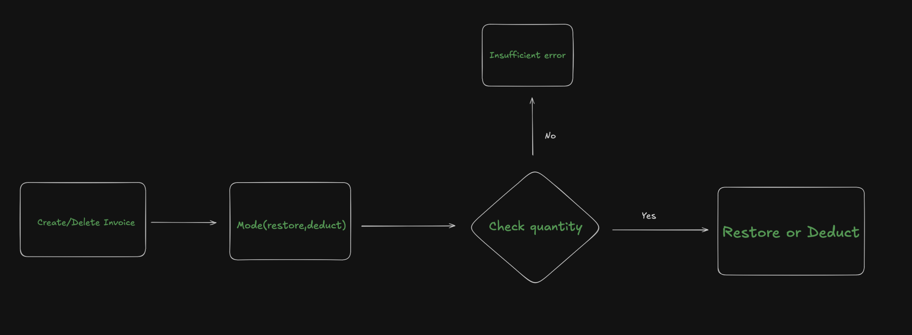

# Invoice Operations Documentation

This documentation explains how invoice creation and deletion work in the Point-Of-Sale Backend system, with a focus on inventory management through unit adjustments.

## Table of Contents

1. [Overview](#overview)
2. [Invoice Creation Flow](#invoice-creation-flow)
3. [Invoice Deletion Flow](#invoice-deletion-flow)
4. [Unit Adjustment Operations](#unit-adjustment-operations)
5. [Key Components](#key-components)
6. [Error Handling](#error-handling)

## Overview

The invoice system manages sales transactions while automatically maintaining inventory levels through unit adjustments. When an invoice is created, item quantities are deducted from inventory. When an invoice is deleted, quantities are restored.



### Architecture Layers

- **Controller Layer** (`invoice.controller.ts`): Handles HTTP requests/responses
- **Service Layer** (`invoice.service.ts`): Contains business logic and orchestrates transactions
- **Model Layer** (`invoice.model.ts`): Manages database operations
- **Utils Layer** (`invoice.operations.ts`): Handles complex inventory unit calculations

## Invoice Creation Flow

### 1. Controller (`createInvoice`)

**Endpoint**: `POST /api/invoices`

**Request Body**:

```json
{
  "invoiceItems": [
    {
      "barcode": "ABC123",
      "itemName": "Product Name",
      "quantity": 5,
      "purchasePrice": 100,
      "discountPrice": 0,
      "unitType": "pcs"
    }
  ],
  "invoiceServices": [
    {
      "name": "Service Name",
      "retailPrice": 50
    }
  ],
  ...otherInvoiceData
}
```

**Process**:

1. Validates required fields (`invoiceItems` must be present)
2. Extracts user information from request
3. Calls service layer
4. Returns 201 status with created invoice

### 2. Service Layer (`createInvoice`)

**Key Operations**:

```typescript
const createInvoice = async (data: InvoiceServiceInput, user: UserInfo) => {
  const invoice = await prisma.$transaction(async (trx) => {
    // Step 1: Adjust inventory (deduct quantities)
    await adjustUnitAmount(data.invoiceItems, trx, "deduct");

    // Step 2: Calculate invoice totals
    const { subTotal, totalItemDiscount, totalAmount } = calcInvoice(
      data,
      user,
    );

    // Step 3: Create invoice record
    return await invoiceModel.createInvoice(
      {
        ...data,
        subTotal,
        totalItemDiscount,
        totalAmount,
      },
      user,
      trx,
    );
  });

  return invoice;
};
```

**Transaction Flow**:

1. **Inventory Adjustment**: Deducts item quantities from inventory using `adjustUnitAmount`
2. **Price Calculation**: Computes subtotal, discounts, and total amount (applies `pricePercent` markup)
3. **Database Creation**: Creates invoice with items and services
4. **Atomic Operation**: All steps wrapped in database transaction (rollback on failure)

### 3. Model Layer (`createInvoice`)

Creates the invoice record with:

- Invoice header data (totals, dates, location, treatment)
- Invoice items with calculated retail prices (purchase price + user's price percentage markup)
- Invoice services (if any)

**Price Calculation**:

The system automatically converts purchase prices to retail prices using the user's `pricePercent` markup:

```typescript
retailPrice = purchasePrice + (purchasePrice × (pricePercent / 100))
```

**Example**:

- Purchase Price: $100
- User's `pricePercent`: 20%
- Retail Price: $100 + ($100 × 0.20) = $120

This happens in the model layer when creating invoice items:

```typescript
retailPrice: calculatePriceWithIncrease(item.purchasePrice, user.pricePercent);
```

**Includes Related Data**:

- Location information
- Treatment details
- All invoice items
- All invoice services

### 4. Unit Adjustment (`adjustUnitAmount`)

The most critical operation for inventory management.

**Process**:

```typescript
await adjustUnitAmount(invoiceItems, trx, "deduct");
```

**Steps**:

1. **Aggregate Items**: Combines quantities for items with same barcode and unit type

   ```typescript
   // Example: Multiple entries of same item are combined
   { barcode: "ABC", unitType: "pcs", quantity: 5 }
   { barcode: "ABC", unitType: "pcs", quantity: 3 }
   // Becomes:
   { barcode: "ABC", unitType: "pcs", quantity: 8 }
   ```

2. **Get Unique Barcodes**: Extracts unique barcode list to minimize database reads

3. **For Each Barcode**:
   - Fetches item with all unit types from database
   - Sorts units by hierarchy (box → strip → bottle → capsule → tablet → pieces)
   - Processes each adjustment

   **Graceful Error Handling**:

   ```typescript
   const item = await getItemByBarcode(barcode);

   // If item not found, skip to the next one.
   if (!item) {
     // throw new BadRequestError(`Item with Barcode ID ${barcode} not found`);
     continue;
   }
   ```

   The algorithm uses `continue` instead of throwing an error when an item is not found. This is crucial because:
   - **Allows invoice deletion to succeed** even if items have been deleted from inventory
   - **Maintains transaction integrity**: Other items in the invoice can still be processed
   - **Graceful degradation**: System doesn't crash on missing items

   **Use Cases**:
   - Deleting invoices with discontinued items
   - Handling data cleanup scenarios
   - Processing invoices after items were removed from the system
   - Avoiding transaction rollback for non-critical missing items

4. **Apply Adjustments**:
   - Finds matching unit type in item's units
   - Deducts quantity: `newQuantity = currentQuantity - invoiceQuantity`
   - Validates sufficient stock (throws error if negative)
   - Recalculates related units

5. **Recalculate Related Units**:
   Maintains unit conversion consistency across the hierarchy.

   **Example**: If deducting 5 strips (1 strip = 10 tablets):

   ```
   Before: Box=2, Strip=20, Tablet=200
   Deduct: 5 strips
   After:  Box=1, Strip=15, Tablet=150
   ```

6. **Update Database**: Saves all adjusted unit quantities

## Invoice Deletion Flow

### 1. Controller (`deleteInvoice`)

**Endpoint**: `DELETE /api/invoices/:id`

**Process**:

1. Validates invoice ID
2. Calls service layer
3. Returns 200 status on success

### 2. Service Layer (`deleteInvoice`)

**Key Operations**:

```typescript
const deleteInvoice = async (id: number) => {
  await prisma.$transaction(async (trx) => {
    // Step 1: Delete invoice and retrieve items
    const deletedInvoice = await invoiceModel.deleteInvoice(id, trx);

    // Step 2: Parse invoice items
    const parsedInvoice = {
      ...deletedInvoice,
      invoiceItems: deletedInvoice.invoiceItems.map((item) => ({
        ...item,
        unitType: item.unitType as UnitType,
      })),
    };

    // Step 3: Restore inventory quantities
    await adjustUnitAmount(parsedInvoice.invoiceItems, trx, "restore");
  });
};
```

**Transaction Flow**:

1. **Delete Invoice**: Removes invoice record (cascade deletes items/services)
2. **Extract Items**: Retrieves deleted invoice items for inventory restoration
3. **Restore Inventory**: Adds back quantities using `adjustUnitAmount`
4. **Atomic Operation**: Wrapped in transaction for data consistency

### 3. Model Layer (`deleteInvoice`)

Deletes invoice with cascade:

```typescript
return trx.invoice.delete({
  where: { id },
  include: {
    invoiceItems: true, // Returns deleted items
    location: true,
    treatment: true,
    invoiceServices: true,
  },
});
```

### 4. Unit Restoration (`adjustUnitAmount`)

Same function as creation, but with `"restore"` operation:

```typescript
await adjustUnitAmount(parsedInvoice.invoiceItems, trx, "restore");
```

**Process**:

- Follows same aggregation and barcode extraction logic
- Adds quantities instead of deducting: `newQuantity = currentQuantity + invoiceQuantity`
- No validation for negative values (restoration always succeeds)
- Recalculates unit hierarchy to maintain consistency

## Unit Adjustment Operations

### Price Percent Markup System

The system uses a **user-based markup percentage** (`pricePercent`) to convert purchase prices to retail prices automatically during invoice creation.

#### How It Works

**Formula**:

```typescript
retailPrice = purchasePrice + (purchasePrice × (pricePercent / 100))
// Or simplified: retailPrice = purchasePrice × (1 + pricePercent / 100)
```

**Function Implementation** (`calcInvoice.ts`):

```typescript
export const calculatePriceWithIncrease = (
  price: number,
  pricePercent: number,
) => {
  return price + price * (pricePercent / 100);
};
```

#### Real-World Examples

| Purchase Price | pricePercent | Calculation          | Retail Price |
| -------------- | ------------ | -------------------- | ------------ |
| $100           | 20%          | $100 + ($100 × 0.20) | $120         |
| $50            | 15%          | $50 + ($50 × 0.15)   | $57.50       |
| $200           | 30%          | $200 + ($200 × 0.30) | $260         |
| $75            | 0%           | $75 + ($75 × 0)      | $75          |

#### Where It's Applied

1. **During Invoice Creation** (`invoice.model.ts`):

   ```typescript
   retailPrice: calculatePriceWithIncrease(
     item.purchasePrice,
     user.pricePercent,
   );
   ```

   Each invoice item's retail price is calculated when the invoice is created.

2. **During Total Calculation** (`calcInvoice.ts`):
   ```typescript
   const price = calculatePriceWithIncrease(
     item.purchasePrice!,
     user!.pricePercent,
   );
   acc.subTotal += price * quantity;
   ```
   Used to compute invoice subtotals and totals.

#### User Role-Based Pricing

The `pricePercent` is stored in the user's profile, allowing:

- **Different markups per user**: Admin might have 20%, while a location manager has 15%
- **Consistent pricing**: Same user always applies the same markup
- **Flexible pricing strategy**: Easy to adjust margins per user/role
- **Historical accuracy**: Invoice stores the calculated retail price, preserving the markup at time of sale

#### Complete Invoice Calculation Flow

**Code Reference** (`calcInvoice.ts`):

```typescript
// Step 1: Calculate items totals
const itemsTotals = data.invoiceItems.reduce(
  (acc, item) => {
    const price = calculatePriceWithIncrease(
      item.purchasePrice,
      user.pricePercent,
    );
    const quantity = item.quantity || 0;
    const discount = item.discountPrice || 0;

    acc.subTotal += price * quantity; // Accumulate line totals
    acc.discount += discount * quantity; // Accumulate item discounts

    return acc;
  },
  { subTotal: 0, discount: 0 },
);

// Step 2: Calculate services total
const servicesTotal = data.invoiceServices.reduce((sum, service) => {
  return sum + (service?.retailPrice || 0);
}, 0);

// Step 3: Calculate final totals
return {
  subTotal: itemsTotals.subTotal + servicesTotal,
  totalItemDiscount: itemsTotals.discount,
  totalAmount:
    itemsTotals.subTotal +
    servicesTotal -
    itemsTotals.discount -
    data.discountAmount,
};
```

**Flow Breakdown**:

```typescript
// For each invoice item:
1. Start with purchase price
2. Apply pricePercent markup → retail price
3. Multiply by quantity → line total
4. Track item discount separately (discount × quantity)

// For entire invoice:
5. Sum all item line totals → items subtotal
6. Sum all service retail prices → services total
7. Add items subtotal + services total → invoice subtotal
8. Subtract total item discounts → after item discounts
9. Subtract invoice-level discount → final total amount
```

**Example Invoice Calculation**:

```
Item 1: Purchase $100, Quantity 2, pricePercent 20%, Item Discount $0
  → Retail Price: $100 + ($100 × 0.20) = $120
  → Line Total: $120 × 2 = $240
  → Item Discount Total: $0 × 2 = $0

Item 2: Purchase $50, Quantity 3, pricePercent 20%, Item Discount $5 per unit
  → Retail Price: $50 + ($50 × 0.20) = $60
  → Line Total: $60 × 3 = $180
  → Item Discount Total: $5 × 3 = $15

Service 1: $30 (retail price, no markup needed)

Invoice-Level Discount: $10

Step-by-Step Calculation:
1. Items Subtotal = $240 + $180 = $420
2. Services Total = $30
3. Invoice Subtotal = $420 + $30 = $450
4. Total Item Discounts = $0 + $15 = $15
5. After Item Discounts = $450 - $15 = $435
6. Invoice-Level Discount = $10
7. Final Total Amount = $435 - $10 = $425

Returned Values:
  subTotal: $450
  totalItemDiscount: $15
  totalAmount: $425
```

### Unit Type Hierarchy

```typescript
const unitType = [
  "pkg", // Package (largest)
  "box", // Box
  "strip", // Strip of tablets
  "btl", // Bottle
  "amp", // Ampoule
  "tube", // Tube
  "sac", // Sachet
  "cap", // Capsule
  "tab", // Tablet
  "pcs", // Pieces (smallest)
];
```

### Conversion Logic

Units are stored with conversion rates. Example:

```
1 Box = 10 Strips (rate: 10)
1 Strip = 12 Tablets (rate: 12)
```

**Why Rates Are Crucial**:

The conversion `rate` for each unit type is the foundation of the entire inventory adjustment algorithm. Without accurate rates, the system cannot:

1. **Maintain Inventory Consistency**: When you sell 1 box, the system must know how many strips and tablets that represents

   ```typescript
   // If rate is wrong:
   Box rate: 10 (should be 10) ✓
   Strip rate: 15 (should be 12) ✗
   // Result: Selling 1 strip would incorrectly adjust tablets by 15 instead of 12
   ```

2. **Cascade Changes Correctly**: The `recalculateRelatedUnits` function depends entirely on rates

   ```typescript
   // Downward calculation
   childQuantity = parentQuantity × rate

   // Upward calculation
   parentQuantity = floor(childQuantity ÷ rate)
   ```

3. **Prevent Inventory Errors**: Wrong rates lead to:
   - Overselling (showing more stock than exists)
   - Underselling (blocking sales when stock is available)
   - Audit discrepancies
   - Financial reporting errors

**Real Example**:

```
Item: Paracetamol
- 1 Box = 20 Strips (rate: 20)
- 1 Strip = 10 Tablets (rate: 10)

Starting Inventory:
- Box: 5
- Strip: 100
- Tablet: 1000

Sell 2 Strips:
1. Deduct Strip: 100 - 2 = 98 strips
2. Recalculate Tablet (down): 98 × 10 = 980 tablets
3. Recalculate Box (up): 98 ÷ 20 = 4 boxes (floor)

Ending Inventory:
- Box: 4 (was 5, now rounded down)
- Strip: 98 (direct adjustment)
- Tablet: 980 (cascaded from strips)
```

**What Happens with Wrong Rates**:

```
If Strip rate was set to 15 instead of 10:
- Tablet calculation: 98 × 15 = 1470 tablets (wrong!)
- System shows phantom inventory of 470 tablets
- Can lead to overselling by 470 units
```

**Rate Definition Best Practices**:

- Define rates from smallest to largest unit (tablets per strip, strips per box)
- Validate rates match physical packaging
- Keep rates consistent across all locations
- Audit rates regularly for accuracy

### Recalculation Algorithm

The `recalculateRelatedUnits` function maintains consistency:

**When adjusting the largest unit (index 0)**: Cascades down

```
Box adjusted → recalculate Strip → recalculate Tablet
```

**When adjusting the smallest unit (last index)**: Cascades up

```
Tablet adjusted → recalculate Strip → recalculate Box
```

**When adjusting middle unit**: Cascades both directions

```
Strip adjusted → recalculate Tablet (down) + recalculate Box (up)
```

**Formulas**:

- **Downward**: `childQuantity = parentQuantity × rate`
- **Upward**: `parentQuantity = floor(childQuantity ÷ rate)`

## Key Components

### `invoice.controller.ts`

HTTP interface for invoice operations:

- Request validation
- Response formatting
- Error forwarding to middleware

### `invoice.service.ts`

Business logic orchestration:

- Transaction management
- Price calculations
- Data parsing (Decimal to number conversion)
- Error handling with custom messages

### `invoice.model.ts`

Database operations:

- Prisma queries
- Data relationships (locations, treatments, items, services)
- ABAC (Attribute-Based Access Control) filtering
- **Retail price calculation** using user's `pricePercent` markup

### `invoice.operations.ts`

Complex inventory algorithms:

- Item aggregation for efficiency
- Unit conversion calculations
- Hierarchy-aware quantity adjustments
- Atomic unit updates

## Error Handling

### Common Errors

**BadRequestError**:

- Missing required invoice data
- Insufficient stock during deduction
- Invalid unit type for item
- Missing barcode in system

**NotFoundError**:

- Invoice not found during retrieval/deletion

**PrismaError (P2025)**:

- Related data not found during creation
- Invoice not found during deletion

### Transaction Safety

All operations use database transactions:

- **Atomicity**: All changes succeed or all fail
- **Consistency**: Inventory always matches invoices
- **Isolation**: Concurrent operations don't conflict
- **Durability**: Changes are permanently saved

**Example Rollback Scenario**:

```
1. Deduct inventory ✓
2. Calculate totals ✓
3. Create invoice ✗ (error)
→ Inventory deduction is rolled back automatically
```

## Best Practices

1. **Always use transactions** for operations affecting inventory
2. **Aggregate items** before processing to reduce database calls
3. **Validate stock** before deduction to provide clear error messages
4. **Parse Decimal types** when returning data to avoid serialization issues
5. **Include related data** in delete operations for proper restoration
6. **Use typed enums** for unit types to prevent invalid values

## Example Usage

### Creating an Invoice

```typescript
// Request
POST /api/invoices
{
  "invoiceItems": [
    {
      "barcode": "MED001",
      "itemName": "Paracetamol",
      "quantity": 2,
      "purchasePrice": 50,
      "discountPrice": 0,
      "unitType": "strip"
    }
  ],
  "locationId": 1,
  "treatmentId": 5
}

// Response (201)
{
  "status": "success",
  "message": "Invoice created successfully",
  "data": {
    "id": 123,
    "subTotal": 100,
    "totalAmount": 100,
    "invoiceItems": [...]
  }
}
```

### Deleting an Invoice

```typescript
// Request
DELETE /api/invoices/123

// Response (200)
{
  "status": "success",
  "message": "Invoice deleted successfully",
  "data": null
}

// Inventory is automatically restored
```

## Technical Notes

- Uses Prisma ORM for database operations
- Supports multiple unit types with automatic conversion
- Implements ABAC for multi-tenant access control
- **Applies user-specific price markup (`pricePercent`)** to convert purchase prices to retail prices
- Maintains audit trail through timestamps
- Supports both items and services in invoices
